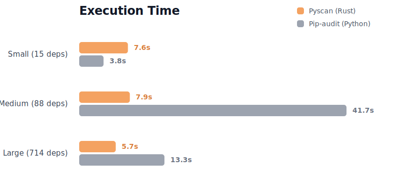
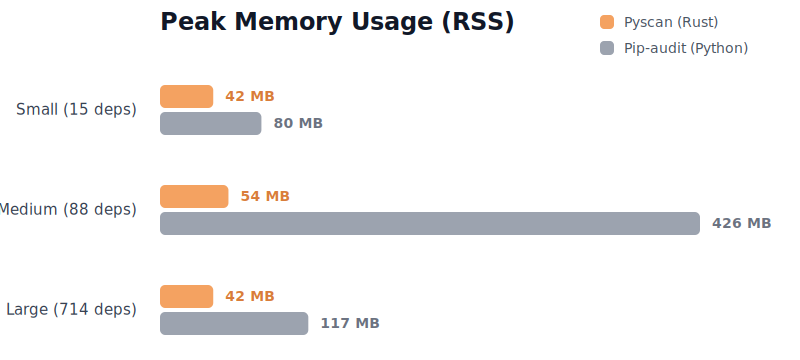

> [!NOTE]
> The benchmarks were performed on a 12th Gen Intel i5 machine running Arch Linux, testing across three distinct dataset sizes: Small (15 dependencies), Medium (88 dependencies), and Large (714 dependencies). Done using `hyperfine`. 3 warmups and 5 runs. It is reproducible, find more about it in [benchmarks](./benchmarks/) directory.

### Execution Time (Lower is better)

*Note: Pyscan achieves a massive **5.25x speedup** against pip-audit and a **2.30x speedup** against safety on medium datasets.*

### Memory Footprint

---

### **Why is the Large dataset (5.7s) faster than the Small dataset (7.6s)?**

Pyscan operates on an $O(\text{vulns})$ time complexity model, not an $O(\text{deps})$ model. 
1. Pyscan uses a highly optimized batch query to ask the OSV database about all dependencies in a *single HTTP request*. 
2. However, for every vulnerability found, Pyscan concurrently fetches additional details.

The execution time is governed by the API's network latency (~776ms). 

The Small dataset simply contained dependencies with a higher density of vulnerabilities, triggering more parallel network requests than the Large dataset. 

This is an advantage in production systems because it does not matter whether your project has 10 or 10,000 dependencies, its runtime is solely based on the number of vulnerabilities. Get less vulnerabilities, spend less time running.

### Memory Profile

The most striking advantage of Pyscan is its memory efficiency. Whether scanning 15 packages or 700+, Pyscan's RAM usage remains completely flat (between 42MB and 54MB). Pyscan leverages Rust's zero-cost abstractions and efficient memory management. Data is streamed and dropped as soon as it's processed, making Pyscan the perfect tool for memory-constrained CI/CD pipelines.

This architecture already obliterates older versions of Pyscan (which took minutes to run) by abandoning sequential queries for parallel `reqwest` batching.

Pyscan could **theoretically** run in $O(1)$ if the OSV database API provided the full vulnerability details in the initial batch response or had a batched `vulninfo` API Endpoint. The only real bottleneck is having to send an HTTP request everytime to fetch each vuln's details other than the usual network latency.