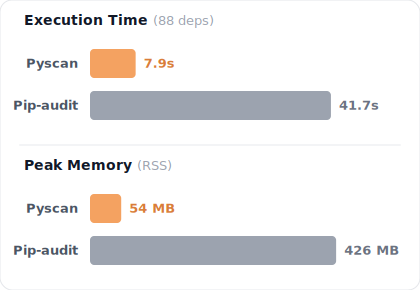

<h1 align="center">Pyscan</h1>

<p align="center">
  
  
  <a href="https://pypi.org/project/pyscan-rs"></a>
  <a href="https://crates.io/crates/pyscan"></a>
  
  <a href="https://pepy.tech/projects/pyscan-rs"></a>
</p>

<p align="center">
  
</p>

<p align="center">
  Pyscan is a highly concurrent vulnerability scanner written in Rust. It automatically traverses your Python project, extracts dependencies across various packaging formats, and cross-references them against the <a href="https://osv.dev/">Open Source Vulnerabilities (OSV)</a> database in a single asynchronous batch request.
</p>

---

Pyscan was engineered to solve the performance and memory bottlenecks of traditional Python-based security tools:
- **Massive Performance Gains:** Achieves up to a **5.25x speedup** against industry-standard tools like `pip-audit` on medium to large datasets. Pyscan's runtime operates on an $O(\text{vulns})$ time complexity model, execution time scales with the number of vulnerabilities found, **not** the number of dependencies you have.
- **Flat Memory Footprint:** Pyscan's memory usage stays completely flat (~45MB) whether you're scanning 15 dependencies or 700+ dependencies. Pretty solid for memory-constrained CI/CD pipelines.
- **Universal Support:** Automatically resolves and extracts dependencies from `uv.lock`, `requirements.txt`, `pyproject.toml` (Poetry, Hatch, PDM, Flit), or dynamically by parsing your raw `.py` source code.

Read the deep-dive in [Benchmarks Report](BENCHMARKS.md).

## Installation

You can install Pyscan via `pipx`, `pip` (compiled Python wheel) or `cargo` (native Rust binary):

```bash
# via pipx (recommended) (Note the "-rs" suffix)
pipx install pyscan-rs

# via pip (Note the "-rs" suffix) 
pip install pyscan-rs

# via Cargo
cargo install pyscan
```

## Usage

Simply run `pyscan` in your project's root directory, or point it to a specific source folder:

```bash
# Scan the current directory
pyscan

# Scan a specific directory
pyscan -d path/to/src
```

### Dependency Resolution Precedence
If multiple source files are present, Pyscan extracts dependencies following this priority chain:
1. `uv.lock`
2. `requirements.txt`
3. `pyproject.toml`
4. Raw Source Code (`.py`)

*Pyscan will fall back to querying PyPI for the latest version if a dependency is found without a strictly pinned version, though adhering to PEP-508 syntax is highly recommended.*

## Building & Architecture

Pyscan requires a Rust toolchain `>= v1.70` and leverages asynchronous networking via `reqwest` and `tokio` to parallelize OSV queries and maximize throughput. If you're interested in how the parser and scanner are structured, check out the[Architecture Overview](./architecture/).

## Disclaimer

Pyscan is a highly optimized tool, but it hasn't been battle-hardened across every edge case yet. It does not guarantee your code is 100% safe from all vectors. I highly recommend using a layered security approach alongside tools like Dependabot, `pip-audit`, or Trivy. PRs and issues are warmly welcomed!

## Roadmap (As of April 2026)

- [ ] Persistent state representation of a project's security posture.
- [ ] Graphical DAG analysis of transitive dependencies.
- [ ] Advanced filtering, searching, and terminal UI improvements for vulnerability display.

## Donate

I started this project when I was a broke high school student, and now I'm a broke college student. If Pyscan has saved your CI/CD pipelines some precious time and RAM, consider buying me a coffee:

[](https://ko-fi.com/Z8Z74DCR4)
