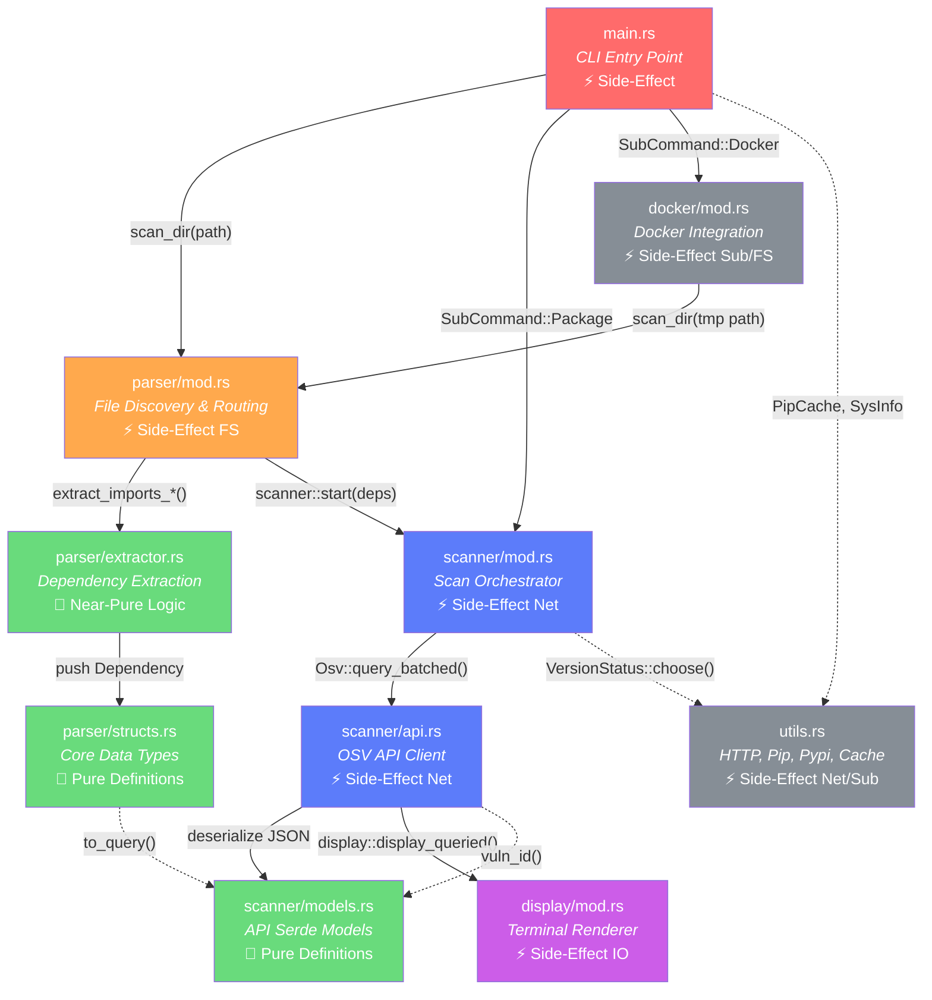
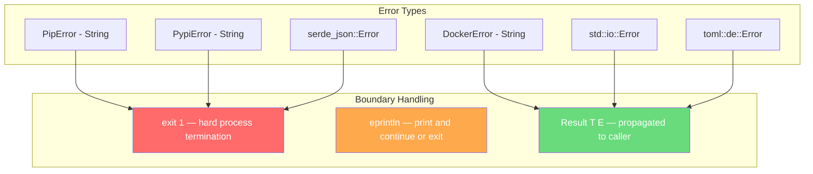

# ARCH_MANIFEST.md — pyscan System Manifest

> **Version**: 0.1.8  
> **Generated**: 2026-04-13  
> **Scope**: Single-crate CLI application (`pyscan`) — a Python dependency vulnerability scanner written in Rust.

---

## 1. High-Level System Architecture

### 1.1 Conceptual Model

pyscan follows a **Pipeline / Staged-Procedural** architecture. Data flows linearly through four well-defined stages — there is no event bus, no actor system, and no hexagonal port/adapter abstraction. The top-level control flow is strictly procedural (`main → parser → scanner → display`), while each stage internally uses structs and enums in an OOP-adjacent style.

| Stage | Responsibility | Purity |
|---|---|---|
| **CLI** (`main.rs`) | Argument parsing, global static init, entry-point dispatch | Side-Effect (IO) |
| **Parser** (`parser/`) | Filesystem scanning, file-type detection, dependency extraction | Side-Effect (FS reads) |
| **Scanner** (`scanner/`) | Version resolution, OSV API queries, vulnerability correlation | Side-Effect (Network) |
| **Display** (`display/`) | Terminal output formatting and summary rendering | Side-Effect (IO) |
| **Utils** (`utils.rs`) | Shared helpers: HTTP client, pip/pypi version retrieval, caching | Side-Effect (Subprocess, Network) |
| **Docker** (`docker/`) | Container creation, file extraction, cleanup | Side-Effect (Subprocess, FS) |

> **There are no pure-logic modules.** Every module performs IO. The closest to pure logic is `parser::extractor`, which takes `String` input and produces `Vec<Dependency>` output — but it's not isolated behind a trait boundary.

### 1.2 Crate / Module Graph



**Legend**: 🟥 Entry Point · 🟧 Parser Stage · 🟩 Pure / Near-Pure · 🟦 Scanner Stage · 🟪 Display · ⬜ Utilities

---

## 2. The Execution Lifecycle ("The Golden Thread")

### 2.1 Primary Flow: `pyscan` (no subcommand)

```
CLI args parsed (clap)
  │
  ├─ Global statics initialized:
  │    ARGS: Lazy<OnceLock<Cli>>      ← parsed CLI args, write-once
  │    PIPCACHE: Lazy<PipCache>       ← HashMap<pkg, ver> from `pip list`
  │    VULN_IGNORE: Lazy<Vec<String>> ← IDs from .pyscanignore
  │
  ├─ SysInfo::new().await             ← checks pip/pypi reachability
  │
  ├─ tokio::task::spawn(cache init)   ← PIPCACHE warm-up on background thread
  │
  └─ parser::scan_dir(dir)
       │
       ├─ fs::read_dir(dir)           ← scan for known file types
       │    └─ builds FoundFileResult { files: Vec<FoundFile>, counters }
       │
       ├─ find_import(result)          ← priority dispatch:
       │    │   requirements.txt > constraints.txt > uv.lock > pyproject.toml > setup.py > *.py
       │    │
       │    └─ find_reqs_imports() / find_pyproject_imports() / ...
       │         │
       │         ├─ Read file contents
       │         ├─ extractor::extract_imports_*()   ← PEP 508 / regex / TOML parsing
       │         │    └─ pushes Dependency { name, version?, comparator? } into Vec
       │         │
       │         └─ scanner::start(imports: Vec<Dependency>)
       │              │
       │              ├─ Osv::new().await             ← build reqwest Client, verify osv.dev
       │              │
       │              ├─ Resolve missing versions (futures::future::join_all):
       │              │    └─ VersionStatus::choose()  ← source → pip → pypi fallback
       │              │
       │              ├─ Batch query: POST /v1/querybatch
       │              │    ├─ deps → Vec<Query> → QueryBatched → JSON body
       │              │    └─ response → QueryResponse { results: Vec<QueryResult> }
       │              │
       │              ├─ For each result with vulns:
       │              │    ├─ Filter against VULN_IGNORE + --ignorevulns (unless --pedantic)
       │              │    ├─ Osv::vuln_id(id) → GET /v1/vulns/{id} → Vuln struct
       │              │    └─ Collect into Vec<ScannedDependency>
       │              │
       │              ├─ display::display_queried(&scanneddeps, &mut imports_info)
       │              │    ├─ Print vulnerable deps (red)
       │              │    ├─ Print safe deps (green)
       │              │    └─ display_summary() — ID, details, affected versions
       │              │
       │              └─ exit(1) if vulns found, Ok(()) otherwise
```

### 2.2 Ownership Handoffs

| Handoff Point | Mechanism | Why |
|---|---|---|
| `ARGS`, `PIPCACHE`, `VULN_IGNORE` | `static Lazy<...>` (write-once globals) | CLI args and pip cache are needed across modules. `OnceLock` guarantees single-write safety without `Mutex`. No `Arc<Mutex<T>>` anywhere. |
| `Vec<Dependency>` from parser → scanner | **Move** (`scanner::start(imports)`) | The parser fully relinquishes the dependency vector. No shared ownership. |
| `&Vec<FoundFile>` within parser | **Immutable borrow** | `find_*_imports(&files)` borrows the file list; ownership stays with `FoundFileResult`. |
| `&mut Vec<Dependency>` inside extractors | **Mutable borrow** | Extractors push into a caller-owned `Vec` rather than returning a new one. |
| `ScannedDependency` from scanner → display | **Immutable borrow** (`&Vec<ScannedDependency>`) | Display reads but never owns the data. |
| `imports_info` HashMap | **Mutable borrow** (`&mut HashMap`) | Display mutably borrows to `.remove()` vulnerable deps, leaving safe ones for green-printing. |

> **Key finding**: There is **zero** use of `Arc`, `Mutex`, `RwLock`, or `RefCell` in this codebase. All concurrency is expressed through `tokio::spawn` with `move` closures over `Copy`/`Clone` data, or through `futures::future::join_all` on borrowed iterators.

### 2.3 Async Strategy

| Component | Model | Details |
|---|---|---|
| **Runtime** | `tokio` multi-threaded (`#[tokio::main]`) | Default Tokio scheduler with `rt-multi-thread` feature. |
| **PipCache init** | `tokio::task::spawn` (fire-and-forget) | Runs `pip list` (blocking subprocess!) on a separate Tokio task. Known issue — author notes it "still blocks" because `pip_list()` is sync and async closures aren't stable yet. |
| **Version resolution** | `futures::future::join_all` | All missing dependency versions are resolved concurrently via async `VersionStatus::choose()` calls. |
| **OSV batch query** | Single `POST` await | The batch API reduces N queries to 1. Sequential `vuln_id()` calls follow for detail fetching (not parallelized). |
| **Blocking subprocess calls** | `std::process::Command` (synchronous) | `pip show`, `pip list`, Docker commands are all blocking. They block the Tokio thread — no `spawn_blocking` is used. |

> [!WARNING]
> **Architecture Risk**: Blocking `Command` calls inside async context without `spawn_blocking` can starve the Tokio thread pool under load.

---

## 3. The Trait & Interface Blueprint

### 3.1 Trait Inventory

**pyscan defines zero custom traits.** The codebase is entirely struct-and-function based. Polymorphism is achieved through:

1. **Enum dispatch** (`FileTypes`, `SubCommand`) rather than trait objects.
2. **Function routing** (`find_import()` dispatches based on `FoundFileResult` counters).
3. **Serde's `Serialize`/`Deserialize`** — the only traits derived/implemented are from external crates.

| Derived/Implemented Trait | On Type | Purpose |
|---|---|---|
| `clap::Parser` | `Cli` | CLI argument parsing |
| `clap::Subcommand` | `SubCommand` | Subcommand dispatch |
| `serde::Serialize + Deserialize` | `Query`, `QueryBatched`, `QueryResponse`, `Vulnerability`, `Vuln`, etc. | JSON serialization for OSV API |
| `std::error::Error` | `DockerError`, `PipError`, `PypiError` | Custom error types |
| `std::fmt::Display` | `DockerError`, `PipError`, `PypiError` | Error message formatting |
| `From<reqwest::Error>` | `PypiError` | Error conversion |
| `Debug, Clone` | Nearly all structs | Development ergonomics |

### 3.2 Implicit Interfaces (Function Signatures as Contracts)

Although there are no formal traits, there are **de facto contracts** that any new extractor or data source must follow:

#### Extractor Contract

```rust
/// Every extractor function MUST conform to this signature:
pub fn extract_imports_<source>(
    input: String,            // raw file content or line
    imp: &mut Vec<Dependency> // accumulator — push extracted deps here
)
// Return: () — errors are printed inline, not propagated.
```

#### Scanner Entry Contract

```rust
/// The scanner expects a fully populated Vec<Dependency>.
/// Versions may be None — the scanner will resolve them via VersionStatus::choose().
pub async fn start(imports: Vec<Dependency>) -> Result<(), std::io::Error>
```

### 3.3 New Module Template: Adding a New File-Type Parser

To add support for parsing a new Python dependency format (e.g., `Pipfile`), follow this template:

```rust
// In src/parser/extractor.rs — add:
pub fn extract_imports_pipfile(content: String, imp: &mut Vec<Dependency>) {
    // 1. Parse the file content (e.g., TOML for Pipfile)
    // 2. For each dependency found:
    imp.push(Dependency {
        name: "package_name".to_string(),
        version: Some("1.0.0".to_string()),  // or None if absent
        comparator: None,                      // or Some(pep_508::Comparator)
        version_status: VersionStatus {
            pypi: false,
            pip: false,
            source: true,  // true if version came from the file
        },
    });
}
```

```rust
// In src/parser/structs.rs — extend FileTypes enum:
pub enum FileTypes {
    // ... existing variants ...
    Pipfile,  // ← add this
}
```

```rust
// In src/parser/mod.rs — add detection + routing:
// 1. In scan_dir(): add filename match for "Pipfile"
// 2. In find_import(): add priority logic in the if/else chain
// 3. Add async fn find_pipfile_imports() following existing pattern
```

---

## 4. Invariants & Safety Constraints

### 4.1 Logical Invariants

| Invariant | Location | Enforcement |
|---|---|---|
| **`ARGS` is written exactly once** | `main.rs:113` | `OnceLock` guarantees single initialization. Second write panics. |
| **`PIPCACHE` is immutable after init** | `utils.rs:265-302` | `Lazy` initializes on first access. No `&mut self` methods are called post-init (only `lookup(&self)`). `_clear_cache(&mut self)` exists but is never invoked. |
| **File-type priority is deterministic** | `parser/mod.rs:78-105` | `find_import()` enforces strict ordering: `requirements.txt` > `constraints.txt` > `uv.lock` > `pyproject.toml` > `setup.py` > `.py`. Encoded as if/else-if chain, not configurable. |
| **Every dependency reaching the scanner MUST have a version** | `scanner/api.rs:86-94` | `query_batched()` resolves all `None` versions via `VersionStatus::choose()` before building queries. `to_query()` calls `.unwrap()` on the version — **panics if None**. |
| **OSV must be reachable before scanning begins** | `scanner/api.rs:29-55` | `Osv::new()` performs a health check GET to `osv.dev`. Failure calls `exit(1)`. |
| **Ignored vulns are union of file + CLI args** | `scanner/api.rs:147` | Both `.pyscanignore` contents and `--ignorevulns` are checked, bypassed if `--pedantic` is set. |

### 4.2 Error Propagation Map



**Pattern**: The codebase overwhelmingly uses **`exit(1)` as the error handler**. There is no unified `Error` enum. Each module defines its own newtype error (`PipError`, `PypiError`, `DockerError`) that wraps a `String`. Errors are:

1. **Printed** via `eprintln!()`
2. **Terminated** via `std::process::exit(1)`
3. **Rarely propagated** — `Result` returns exist but callers typically `.unwrap()` or match-and-exit.

> [!IMPORTANT]
> **Architecture Debt**: The aggressive use of `exit(1)` makes the code untestable and prevents graceful error recovery. A unified `PyscanError` enum with `thiserror` would be the natural refactor.

### 4.3 Safety: `unsafe` Audit

**There are exactly zero `unsafe` blocks in this codebase.** All code is safe Rust. The dependencies that may use `unsafe` internally include:

- `openssl` (vendored) — FFI bindings to libssl
- `reqwest` / `tokio` — runtime internals
- `regex` — SIMD optimizations

No raw pointer manipulation, no `transmute`, no manual memory management exists in the application code.

---

## 5. LLM Extension Points ("The Hooks")

### 5.1 Add a New Dependency Source Format

**Goal**: Support parsing `Pipfile`, `conda.yaml`, `setup.cfg`, etc.

1. **Add a `FileTypes` variant** in `src/parser/structs.rs` (line 13-19):
   ```rust
   pub enum FileTypes {
       // ...existing...
       Pipfile,
   }
   ```

2. **Add an `is_*()` helper** on `FoundFile` (same file, around line 28-41).

3. **Add counter field + incrementor** on `FoundFileResult` (same file, around line 43-83).

4. **Write the extractor** in `src/parser/extractor.rs`:
   ```rust
   pub fn extract_imports_pipfile(content: String, imp: &mut Vec<Dependency>) { ... }
   ```

5. **Wire it into `scan_dir()`** in `src/parser/mod.rs` (line 11-75) — add filename match.

6. **Wire it into `find_import()`** in `src/parser/mod.rs` (line 78-101) — add priority level.

7. **Create `async fn find_pipfile_imports()`** following the existing `find_reqs_imports()` pattern.

### 5.2 Add a New Vulnerability Database

**Goal**: Query a second advisory source alongside OSV (e.g., Snyk, GitHub Advisory).

1. **Create a new struct** in `src/scanner/api.rs` (e.g., `Snyk`).

2. **Implement constructor + query methods** mirroring `Osv::new()` and `Osv::query_batched()`.

3. **Add serde models** in `src/scanner/models.rs` for the new API's response format.

4. **Modify `scanner::start()`** in `src/scanner/mod.rs` (line 8-28) to instantiate both and merge results.

5. **Respect the `--skip` CLI argument** (currently hidden) in `src/main.rs` (line 41-48) to allow users to skip databases.

### 5.3 Extend the CLI

**Goal**: Add a new subcommand or flag.

1. **For a flag**: Add a field to the `Cli` struct in `src/main.rs` (line 25-86) with `#[arg(...)]`.

2. **For a subcommand**: Add a variant to `SubCommand` enum in `src/main.rs` (line 88-111).

3. **Access it anywhere** via `ARGS.get().unwrap().your_field` (the global static pattern).

4. **Handle it** in the `match &ARGS.get().unwrap().subcommand` block in `main()`.

### 5.4 Add a New Output Format

**Goal**: Export results as SARIF, CSV, HTML, etc.

1. **Check the `--output` flag** logic in `src/scanner/api.rs` (line 122-137).

2. **Currently only `.json` is supported** — the check is a raw string suffix match on the filename.

3. **Add new format branches** after the JSON branch:
   ```rust
   if filename.ends_with(".json") { /* existing */ }
   else if filename.ends_with(".sarif") { /* serialize to SARIF */ }
   else if filename.ends_with(".csv") { /* serialize to CSV */ }
   ```

4. **Better approach**: Refactor into an `OutputFormat` enum parsed from the filename extension, and move serialization to the `display` module.

### 5.5 Improve the Docker Integration

**Goal**: Fix or enhance Docker scanning.

1. All Docker logic is isolated in `src/docker/mod.rs`.
2. It creates a temp container, copies files out, calls `parser::scan_dir()` on the extracted path, then cleans up.
3. **Known issues**: Blocking `Command` calls, hardcoded `./tmp/docker-files` path, no `spawn_blocking`.

---

### 5.6 Context Checklist for LLM PRs

Before submitting any change to this codebase, verify:

- [ ] **Global statics**: Did you add a new global? Use `Lazy<OnceLock<T>>` or `Lazy<T>`. Never `static mut`.
- [ ] **Error handling**: Don't add new `exit(1)` calls. Propagate `Result` upward. (Even though the codebase does this, it's tech debt.)
- [ ] **Async discipline**: If calling `std::process::Command`, wrap it in `tokio::task::spawn_blocking()`.
- [ ] **Dependency struct**: All new parsers must produce `Dependency` with `VersionStatus { source: true }` when the version comes from the file.
- [ ] **File priority**: If adding a new file type, decide where it sits in the `find_import()` priority chain. Current order: `requirements.txt` > `constraints.txt` > `uv.lock` > `pyproject.toml` > `setup.py` > `.py`.
- [ ] **Version resolution**: If `version` is `None`, the scanner will call `VersionStatus::choose()`. Ensure your extractor sets it to `None` only when the source genuinely lacks version info.
- [ ] **Serde models**: When adding models for a new API, use `#[serde(rename = "...")]` to match the API's JSON keys exactly. Add `Option<T>` for fields that may be absent.
- [ ] **Testing**: The codebase has no tests currently. If you add one, place it in the same module with `#[cfg(test)]`.
- [ ] **`todo!()` audit**: There are multiple `todo!()` macros in `extractor.rs` (lines 291-296, 370-384). These will **panic at runtime** if hit. Replace with `eprintln!` + `continue` or proper handling.
- [ ] **Exit code contract**: `exit(0)` = no vulns found, `exit(1)` = vulns found or error. Don't break this CI/CD contract.

---

## Appendix: File Index

| File | Lines | Purpose |
|---|---|---|
| `src/main.rs` | 211 | CLI definition, global statics, entry-point dispatch |
| `src/utils.rs` | 330 | HTTP helpers, pip/pypi version retrieval, PipCache, SysInfo |
| `src/parser/mod.rs` | 193 | Directory scanning, file-type routing, import dispatch |
| `src/parser/extractor.rs` | 570 | Extraction logic for requirements.txt, pyproject.toml, setup.py, uv.lock, .py |
| `src/parser/structs.rs` | 186 | `Dependency`, `FoundFile`, `FoundFileResult`, `VersionStatus`, `ScannedDependency` |
| `src/scanner/mod.rs` | 31 | Scanner orchestration, `start()` entry point |
| `src/scanner/api.rs` | 256 | `Osv` struct, single/batch query, vuln_id detail fetch |
| `src/scanner/models.rs` | 431 | Serde models for OSV API + PyPI API responses |
| `src/display/mod.rs` | 171 | `Progress` counter, `display_queried()`, `display_summary()` |
| `src/docker/mod.rs` | 136 | Docker container creation, file extraction, cleanup |
